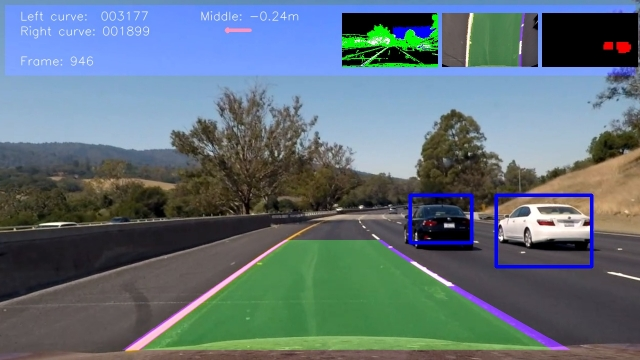

# Draft

# Summary

The steps of this project are the following:

* Feature extraction on a labeled training set of images
  * HOG features
  * Color histogram features
  * Spatial features
* Normalization of the feature vectors
* Training of a Linear SVM classifier on the features
* Finding the best feature and classifier parameters based on
  * Accuracy
  * Runtime
  * Size
* Using a sliding-window technique to search for vehicles in images
* Outlier removal on the video stream with a heatmap
* Bounding box estimation
* Merge with the previous project "Lane Line Detection"

## Output of the pipeline

# Features
## Colorspace
Images can be processed using different color spaces. The most common color space is RGB which composes color from three base colors red, green and blue. This colorspace is good to be shown on a screen which uses the same base colors.

For feature detection the RGB colorspace is often not optimal. Better are color spaces which are based on a lumina signal and some others defining the color. Examples are YUV, YCrCb and HSV.

The following feature examples are all based on the YCrCb color space, the HOG features are calculated from the Y component. However for the final feature descriptor HOG features are calculated from all three components.

## HOG
HOG features of cars:

HOG features of non-cars:

## Color
Color histograms of cars:

Color histograms of non-cars:

# Best parameter search

## HOG features
There are many parameters for the HOG feature calculation. Since the vehicle detection should run very fast to be used in autonomous vehicles it was necessary to use parameters which result in a smaller feature vector.

Finally the following parameters were chosen which are relatively fast to calculate but are good enough for the purpose.

|Parameter               | Value  |
|------------------------|--------|
|Number of orientations  | 9      |
|Pixel per cell          | 16     |
|Cells per block         | 2      |

## Color features
Best results were obtained with the color spaces YUV and YCrCb.
Finally YCrCb was choosen though the other gave similar results.

The histogram used 16 bins.

## Spatial features

## Classifier
The classifier choosen was a linear SVM. Since the feature vector is relatively large compared to the number of training samples the linear SVM should give a good result without overfitting.

The regularization parameter finally used was C=0.001 which gave the best result after testing different values.

## Parameter search

To find the best parameter with the given train and test first some manual tests with some values were done.
It was found out that smaller C values about C=0.001 give best results on the test set.

So a search over the following parameters were done:

Parameter | Value
----------|-------
Colorspaces | YCrCb, HLS, HSV, YUV, BGR
Color histogram bins | 16, 32
HOG orientations | 8, 9, 10
HOG pixels per cell | 16, 8
HOG cells per block | 2, 4
Using spatial featues | True, False
C | 0.0005, 0.001, 0.005, 0.01

The best test set accuracies are shown in the table below:

orient|pix_per_cell|cell_per_block|c|color_space|hist_bins|spatial_feat|num_features|accuracy
-|-|-|-|-|-|-|-|-
8|16|2|0.005|YUV|16|True|1680|0.992201834862385
9|16|2|0.001|YCrCb|16|True|1788|0.991743119266055
9|16|2|0.0005|YUV|16|True|1788|0.991743119266055
9|16|2|0.001|YUV|16|True|1788|0.991284403669725
9|16|2|0.0005|YCrCb|16|True|1788|0.990825688073394
9|16|2|0.005|YCrCb|16|True|1788|0.990366972477064
9|16|2|0.005|YUV|16|True|1788|0.990366972477064
9|8|4|0.0001|YCrCb|16|True|11616|0.990366972477064
8|16|2|0.001|YUV|16|False|912|0.990366972477064
8|16|2|0.001|YUV|16|True|1680|0.989908256880734
8|16|2|0.0005|YCrCb|16|False|912|0.989908256880734
8|16|2|0.0005|YUV|16|False|912|0.989908256880734
8|16|2|0.0005|YCrCb|16|True|1680|0.989449541284404
8|16|2|0.0005|YUV|16|True|1680|0.988532110091743
8|16|4|0.001|YCrCb|16|True|1200|0.988532110091743
8|8|4|0.0001|YUV|16|True|10416|0.988532110091743
9|8|2|0.0001|YCrCb|16|True|6108|0.988532110091743
8|16|2|0.005|YCrCb|16|True|1680|0.988073394495413

Full database with all combinations:

[Parameter database](parameters.db)

[Parameter table (csv)](parameters.csv)

Since the parameter search needs much time the implementation saves the values in a database. The search can be interrupted and only missing parameter combinations are calculated when the search is started again.
First the data was only stored in a csv file but to be save when the search is interrupted while writing to the csv file an additional sqlite3 database was used.
To speed up the search the four C parameters were calculated in parallel using four processes.

## Sources for train and validation data
### GTI
Some samples from GTI data:

### KITTI
Some samples from KITTI data:

### Udacity datset
 To extract the images from the udacity dataset the csv file is read as a pandas dataframe and for every row the corresponding image is extracted.

Only some of the car images are taken from this data set since many of the images are cars from the front side and this project needs to detect only cars from behind.

The non car images were also not helpfull since they contain only objects which don't have to be detected here (traffic lights).

### Video
The images from the video are splitted to smaller samples which are classified by hand to get more non-car samples from the target images (hard negative mining).

## Validation data
Most of the vehicle images used here are from video sequences so many images are very similar to other images. So a random train/test split is not the best way to find optimal model parameters.

Therefore the split was done manually in this project. The images from the GTI dataset are best sorted compared to the other data sets. So it was possible to extract complete image sequences from the GTI dataset and use them as a validation set.

# Implementation

## Lessons learned
### Features calculated from wrong color space or quantization of pixels
* use openCV functions to read images since they use the same quantization for all file formats
* directly after reading the image convert to RGB colorspace which will be the colorspace of video images

### Feature parameters don't match
* Encapsulation of the feature extraction process, no different functions to calculate in different stages (feature extraction for classifier training, video processing)
* Save and restore classifier with all parameters used for feature extraction and normalization. Save and restore done in feature extraction class itself.

## Encapsulation

## Parallelization
To improve the processing speed it is helpful to split the algorithms in pieces which can be processed on different cores.

For the previous projects with neural networks it was possible to use the multi-threading libray of Python to do images preprocessing and augmentation in parallel on the CPU while the GPU was calculating backpropagation.

The problem of the threading library is the "Global Interpreter Lock" (GIL) which ensures that the python threads don't execute code in parallel. When one thread is waiting fo IO (for example the GPU or file access) the other threads can execute. In the current project all calculations are done on the CPU and most time is used for calculating and not for IO.

To overcome this problem and do some real parallelization the multi-processing library from the concurrent.futures module is used here. With this library it is possible to run python code in different processes and merge the result.

Multiprocessing was used to train SVM with different parameter in parallel and use the best model parameters after testing with the test set.

## Parameter search with database

## Files

|File             | Functionality |
|:---------------:|:-------------:|
|RenderVideo.py   | Reads video and runs the detection pipeline |
|ProcessImage.py  | Pipeline for vehicle detection |
|ProcessImageLane.py | Pipeline for lane detection |
|Model.py         | Encapsulates the SVM including parameters, training, save and load |
|FeatureExtrac.py | Encapsulates the feature extraction using HOG, color histogram and spatial histogram, including parameters |
|HelperFunctions.py | Helper functions like drawing boxes or generating box sets |
|FindCars.py      | Older search algorithm |
|CameraCalibration.py | 
|ExtractImages.py | Extract train images from video or from Udacity dataset |
|DataGeneration.py | Generates training data from images |
|Segmentation.py | Flood fill for image segmentation |

GTI: Taken parts for test set since partly ordered
Kitti: many similar images, completely random, removed half of the set
Udacity: extracted with ExtractImages.py, taken manually images from back
Video: taken good examples from video

Done:
- Parallelization with threads (GIL) and processes

Tried:
- Color segmentation with flood fill on detected cars
- Vehicle object with position and velocity

References:

* https://wiki.python.org/moin/GlobalInterpreterLock
* http://www.cvlibs.net/datasets/kitti/
* http://www.gti.ssr.upm.es/data/Vehicle_database.html
* https://docs.python.org/3/library/concurrent.futures.html

## Template
### You can use this file as a template for your writeup if you want to submit it as a markdown file, but feel free to use some other method and submit a pdf if you prefer.

---

**Vehicle Detection Project**

The goals / steps of this project are the following:

* Perform a Histogram of Oriented Gradients (HOG) feature extraction on a labeled training set of images and train a classifier Linear SVM classifier
* Optionally, you can also apply a color transform and append binned color features, as well as histograms of color, to your HOG feature vector. 
* Note: for those first two steps don't forget to normalize your features and randomize a selection for training and testing.
* Implement a sliding-window technique and use your trained classifier to search for vehicles in images.
* Run your pipeline on a video stream (start with the test_video.mp4 and later implement on full project_video.mp4) and create a heat map of recurring detections frame by frame to reject outliers and follow detected vehicles.
* Estimate a bounding box for vehicles detected.

[//]: # (Image References)
[image1]: ./examples/car_not_car.png
[image2]: ./examples/HOG_example.jpg
[image3]: ./examples/sliding_windows.jpg
[image4]: ./examples/sliding_window.jpg
[image5]: ./examples/bboxes_and_heat.png
[image6]: ./examples/labels_map.png
[image7]: ./examples/output_bboxes.png
[video1]: ./project_video.mp4

## [Rubric](https://review.udacity.com/#!/rubrics/513/view) Points
### Here I will consider the rubric points individually and describe how I addressed each point in my implementation.  

---
### Writeup / README

#### 1. Provide a Writeup / README that includes all the rubric points and how you addressed each one.  You can submit your writeup as markdown or pdf.  [Here](https://github.com/udacity/CarND-Vehicle-Detection/blob/master/writeup_template.md) is a template writeup for this project you can use as a guide and a starting point.  

You're reading it!

### Histogram of Oriented Gradients (HOG)

#### 1. Explain how (and identify where in your code) you extracted HOG features from the training images.

The code for this step is contained in the first code cell of the IPython notebook (or in lines # through # of the file called `some_file.py`).  

I started by reading in all the `vehicle` and `non-vehicle` images.  Here is an example of one of each of the `vehicle` and `non-vehicle` classes:

![alt text][image1]

I then explored different color spaces and different `skimage.hog()` parameters (`orientations`, `pixels_per_cell`, and `cells_per_block`).  I grabbed random images from each of the two classes and displayed them to get a feel for what the `skimage.hog()` output looks like.

Here is an example using the `YCrCb` color space and HOG parameters of `orientations=8`, `pixels_per_cell=(8, 8)` and `cells_per_block=(2, 2)`:

![alt text][image2]

#### 2. Explain how you settled on your final choice of HOG parameters.

I tried various combinations of parameters and...

#### 3. Describe how (and identify where in your code) you trained a classifier using your selected HOG features (and color features if you used them).

I trained a linear SVM using...

### Sliding Window Search

#### 1. Describe how (and identify where in your code) you implemented a sliding window search.  How did you decide what scales to search and how much to overlap windows?

I decided to search random window positions at random scales all over the image and came up with this (ok just kidding I didn't actually ;):

![alt text][image3]

#### 2. Show some examples of test images to demonstrate how your pipeline is working.  What did you do to optimize the performance of your classifier?

Ultimately I searched on two scales using YCrCb 3-channel HOG features plus spatially binned color and histograms of color in the feature vector, which provided a nice result.  Here are some example images:

![alt text][image4]
---

### Video Implementation

#### 1. Provide a link to your final video output.  Your pipeline should perform reasonably well on the entire project video (somewhat wobbly or unstable bounding boxes are ok as long as you are identifying the vehicles most of the time with minimal false positives.)
Here's a [link to my video result](./project_video.mp4)

#### 2. Describe how (and identify where in your code) you implemented some kind of filter for false positives and some method for combining overlapping bounding boxes.

I recorded the positions of positive detections in each frame of the video.  From the positive detections I created a heatmap and then thresholded that map to identify vehicle positions.  I then used `scipy.ndimage.measurements.label()` to identify individual blobs in the heatmap.  I then assumed each blob corresponded to a vehicle.  I constructed bounding boxes to cover the area of each blob detected.  

Here's an example result showing the heatmap from a series of frames of video, the result of `scipy.ndimage.measurements.label()` and the bounding boxes then overlaid on the last frame of video:

### Here are six frames and their corresponding heatmaps:

![alt text][image5]

### Here is the output of `scipy.ndimage.measurements.label()` on the integrated heatmap from all six frames:
![alt text][image6]

### Here the resulting bounding boxes are drawn onto the last frame in the series:
![alt text][image7]

---

### Discussion

#### 1. Briefly discuss any problems / issues you faced in your implementation of this project.  Where will your pipeline likely fail?  What could you do to make it more robust?

Here I'll talk about the approach I took, what techniques I used, what worked and why, where the pipeline might fail and how I might improve it if I were going to pursue this project further.  