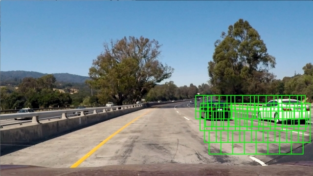

# Summary

The steps of this project are the following:

* Feature extraction on a labeled training set of images
  * HOG features
  * Color histogram features
  * Spatial features
* Normalization of the feature vectors
* Training of a Linear SVM classifier on the features
* Finding the best feature and classifier parameters based on
  * Accuracy
  * Runtime
  * Size
* Using a sliding-window technique to search for vehicles in images
* Outlier removal on the video stream with a heatmap
* Bounding box estimation
* Merge with the previous project "Lane Line Detection"

## Starting
The video processing can be started with

`python3 RenderVideo.py <video filename>`

If the video filename is missing it processes the video `test_video.mp4`.

## Output of the pipeline

## Video result

# Features
## Colorspace
Images can be processed using different color spaces. The most common color space is RGB which composes color from three base colors red, green and blue. This colorspace is good to be shown on a screen which uses the same base colors.

For feature detection the RGB colorspace is often not optimal. Better are color spaces which are based on a lumina signal and some others defining the color. Examples are YUV, YCrCb and HSV.

The following feature examples are all based on the YCrCb color space, the HOG features are calculated from the Y component. However for the final feature descriptor HOG features are calculated from all three components.

## HOG
HOG features of cars:

HOG features of non-cars:

## Color
Color histograms of cars:

Color histograms of non-cars:

# Features

## Implementation
The features are calculated in the class `FeatureExtractor` in `FeatureExtract.py`. It is initialized with a configuration in which all feature parameters are defined.

With the method `calc_features()` the features of an image can be extracted.

## HOG features
There are many parameters for the HOG feature calculation. Since the vehicle detection should run very fast to be used in autonomous vehicles it was necessary to use parameters which result in a smaller feature vector.

Finally the following parameters were chosen which are relatively fast to calculate but are good enough for the purpose.

|Parameter               | Value  |
|------------------------|--------|
|Number of orientations  | 9      |
|Pixel per cell          | 16     |
|Cells per block         | 2      |

Though it was mentioned in the course that with 8 pixels per cell the result should be better since it can better detect the car lights this value has no better accuracy in the test set. Additionally the feature vector is so much larger that the calculation time is too high.

The implementation is in `FeatureExtract.py` in the method `calc_hog_features()` (line 9)

Best results were obtained with the color spaces YUV and YCrCb.
Finally YCrCb was choosen though the other gave similar results.

## Color features
From the three color components a histogram with each 16 bins was used as color features.

## Spatial features
As spatial features the image is resized from 64x64 pixels to 16x16 pixels and the values are taken as feature.
This feature type didn't help much to have a better test set accuracy but gave better results in the video.

## Feature normalization
The feature vectors are normalized using the `StandardScaler` of `sklearn`. It's calculated from the training data features in `Model.py` in line 108. Then it's saved with the other model data.
## Classifier
The classifier choosen was a linear SVM. Since the feature vector is relatively large compared to the number of training samples the linear SVM should give a good result without overfitting.

The regularization parameter finally used was C=0.001 which gave the best result after testing different values.

## Model fitting
The model is encapsulated in the `Model` object in `Model.py`. When its `fit()` method is called it tries to load itself with the corresponding feature parameter from the file SVM.p. If the file is not available it loads the training images and fits a new model which is then saved.

## Parameter search

To find the best parameter with the given train and test first some manual tests with some values were done. The search is implemented in `Model.py` in the `main()` function.

So a search over the following parameters were done:

Parameter | Value
----------|-------
Colorspaces | YCrCb, HLS, HSV, YUV, BGR
Color histogram bins | 16, 32
HOG orientations | 8, 9, 10, 11, 12
HOG pixels per cell | 16, 8
HOG cells per block | 2, 4
Using spatial featues | True, False
C | 0.0005, 0.001, 0.005, 0.01, 0.1, 1, 2, 4

The best test set accuracies are shown in the table below:

orient|pix_per_cell|cell_per_block|c|color_space|hist_bins|spatial_feat|num_features|accuracy
-|-|-|-|-|-|-|-|-
12|16|2|0.0005|YCrCb|16|True|2112|0.994036697247706
10|16|2|0.001|YCrCb|32|True|1944|0.993577981651376
12|16|2|0.0005|YCrCb|32|True|2160|0.993577981651376
12|16|2|0.001|YCrCb|32|False|1392|0.993577981651376
10|16|2|0.001|YUV|16|True|1896|0.993119266055046
11|16|2|0.0005|YCrCb|16|True|2004|0.993119266055046
12|16|2|0.0005|YUV|32|True|2160|0.993119266055046
11|16|2|0.001|YCrCb|16|True|2004|0.992660550458715
12|16|2|0.001|YCrCb|32|True|2160|0.992660550458715
12|16|2|0.001|YUV|32|True|2160|0.992660550458715
8|16|2|0.005|YUV|16|True|1680|0.992201834862385
10|16|2|0.001|YCrCb|16|True|1896|0.992201834862385
10|16|2|0.0005|YCrCb|16|False|1128|0.992201834862385
10|16|2|0.005|YCrCb|32|True|1944|0.992201834862385
12|16|2|0.0005|YCrCb|16|False|1344|0.992201834862385
11|16|2|0.001|YCrCb|32|True|2052|0.992201834862385
11|16|2|0.001|YCrCb|32|False|1284|0.992201834862385

Full database with more than 500 combinations:

[Parameter database](parameters.db)

[Parameter table (csv)](parameters.csv)

Since the parameter search needs much time the implementation saves the values in a database. The search can be interrupted and only missing parameter combinations are calculated when the search is started again.
First the data was only stored in a csv file but to be save when the search is interrupted while writing to the csv file an additional sqlite3 database was used.
To speed up the search the four C parameters were calculated in parallel using four processes.

# Sliding windows

The first try first calculated the HOG features of the complete region of interest and the sliding window algorithm calculateded the feature vector from the resized image and the corresponding parts of the HOG image.
This improved the algorithm speed since for overlapping windows less HOG caluclations had to be done. This algorithm is implemented in `ProcessImage.py` in line 139.

But even this algorithm was to slow. To improve the speed further the next idea was to only detect cars at the borders on the image and track the cars with a car object that has position and speed and updates it's position with every frame based on the speed and the new frame around the predicted position (this is currently not finished).

To achieve this the algorithm was changed to calculate features for every window separetely without using the HOG subsampling.

Tests were done with a triangular region on the right side where the other cars can be found. The windows of the triangular region are calculated once in `ProcessImage.py` in the `fit()` method.

To improve the speed an overlap of only 0.5 of the slinding window was used and in the lower part of the image only larger windows sizes with (96, 96) pixels were used.

In the upper part also windows with size (64, 64) were used.

With smaller windows and more overlap the detection accuracy could be improved but the calculation time becomes much worse. Especially bounding boxes are often too big because the windows have a relatively large distance to each other. The implementation is done in `ProcessImage.py` in line 136.

The concept with the car objects and the tracking algorthm was not implemented since there was not enough time for further development.

## False positive supression
Since the classifier detects many false positives the following methods to supress them were implemented:

* Filtering the detections with a heat map for every frame
* Filtering of the frame heatmap with a global heatmap over many frames
* Rejecting positives with less than 90% confidence
* Testing the video performance with many of the good classifiers found by the parameter search and choosing the best manually
* Hard negative mining with samples extracted from the video

Here are some examples, red is the heat map, green boxes are single positives, blue boxes are the final detection:

## Performance

With the current implementation the video processing runs with 3 images/s on a i5-4670.

## Sources for train and validation data
### GTI
Some samples from GTI data:

### KITTI
Some samples from KITTI data:

### Udacity datset
 To extract the images from the udacity dataset the csv file is read as a pandas dataframe and for every row the corresponding image is extracted.

Only some of the car images are taken from this data set since many of the images are cars from the front side and this project needs to detect only cars from behind.

The non car images were also not helpfull since they contain only objects which don't have to be detected here (traffic lights).

### Video
The images from the video are splitted to smaller samples which are classified by hand to get more non-car samples from the target images (hard negative mining). This is done in `DataGeneration.py` in the method `create_training_data()` of the class `TrainingDataGenerator`.

## Validation data
Most of the vehicle images used here are from video sequences so many images are very similar to other images. So a random train/test split is not the best way to find optimal model parameters.

Therefore the split was done manually in this project. The images from the GTI dataset are best sorted compared to the other data sets. So it was possible to extract complete image sequences from the GTI dataset and use them as a validation set.

# Implementation

## Lessons learned
### Features calculated from wrong color space or quantization of pixels
* use openCV functions to read images since they use the same quantization for all file formats
* directly after reading the image convert to RGB colorspace which will be the colorspace of video images

### Feature parameters don't match
* Encapsulation of the feature extraction process, no different functions to calculate in different stages (feature extraction for classifier training, video processing)
* Save and restore classifier with all parameters used for feature extraction and normalization. Save and restore done in feature extraction class itself.

## Parallelization
To improve the processing speed it is helpful to split the algorithms in pieces which can be processed on different cores.

For the previous projects with neural networks it was possible to use the multi-threading libray of Python to do images preprocessing and augmentation in parallel on the CPU while the GPU was calculating backpropagation.

The problem of the threading library is the "Global Interpreter Lock" (GIL) which ensures that the python threads don't execute code in parallel. When one thread is waiting fo IO (for example the GPU or file access) the other threads can execute. In the current project all calculations are done on the CPU and most time is used for calculating and not for IO.

To overcome this problem and do some real parallelization the multi-processing library from the concurrent.futures module is used here. With this library it is possible to run python code in different processes and merge the result.

Multiprocessing was used to train SVM with different parameter in parallel and use the best model parameters after testing with the test set.

## Parameter search with database

The parameter search is currently implemented inside the main function of `Model.py`. It can be started with `python3 Model.py`.
It creates in parallel a csv file with | as separator which can be used directly in a markup file as table and a sqlite3 database to store the results. The models are saved with different names so the best ones can be tested with the video.

Only for new parameter combinations the model is fitted and the results are stored in the database. So the parameter search can always interrupted and started again with the same or new parameter search space.

## Files

|File             | Functionality |
|:---------------:|:-------------:|
|RenderVideo.py   | Reads video and runs the detection pipeline |
|ProcessImage.py  | Pipeline for vehicle detection |
|ProcessImageLane.py | Pipeline for lane detection |
|Model.py         | Encapsulates the SVM including parameters, training, save and load |
|FeatureExtrac.py | Encapsulates the feature extraction using HOG, color histogram and spatial histogram, including parameters |
|HelperFunctions.py | Helper functions like drawing boxes or generating box sets |
|FindCars.py      | Older search algorithm |
|Vehicles.py     | First try with a vehicle object for tracking |
|CameraCalibration.py | Camera calibration |
|ExtractImages.py | Extract train images from video or from Udacity dataset |
|DataGeneration.py | Generates training data from images |
|Segmentation.py | Flood fill for image segmentation |
|LaneDetection.py | Merge from previous project to detect the lane |
|LaneFit.py | Merge from previous project to detect the lane |
|LaneDetection.py | Merge from previous project to detect the lane |
|ProcessImageLane.py | Merge from previous project to detect the lane |

# Discussion
With the simple sliding window approach it seems to be impossible to find all cars reliably. Since there are many false positives it's necessary to filter the detections over time and the threshold must be relatively high to remove the false positives. Then car detection becomes slower.

To overcome this problem it might be necessary to have a good object tracking with postions, velocities and probabilities what object it is.

An implementation in a fast compilable language is also necessary since the algorithm can't be vectorized efficiently. The sliding window approach needs a double nested loop which should be much faster in a compiled version.

# References:

* https://wiki.python.org/moin/GlobalInterpreterLock
* http://www.cvlibs.net/datasets/kitti/
* http://www.gti.ssr.upm.es/data/Vehicle_database.html
* https://docs.python.org/3/library/concurrent.futures.html